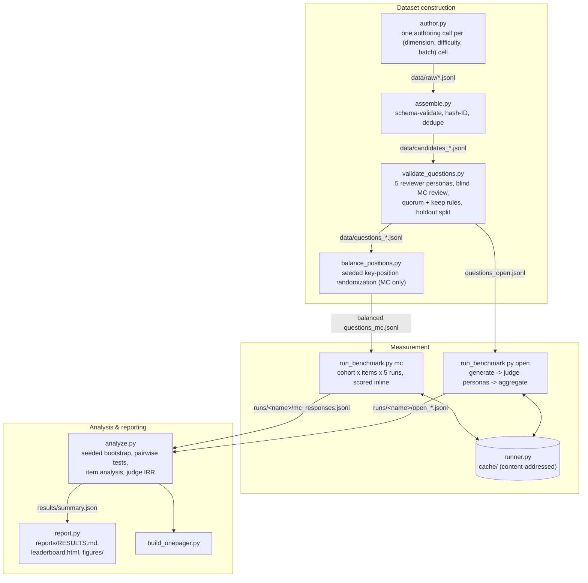

# The DeseretBench Yellow Paper

**Normative technical specification of the v0.1 measurement system.**

---

## 0. Scope and document status

This document specifies precisely what the DeseretBench v0.1 system does: item model,
measurement protocol, scoring and judging rules, statistics, persisted record formats,
and reproducibility guarantees. [PAPER.md](PAPER.md) motivates and reports;
[DESIGN.md](DESIGN.md) narrates the design history. This document does neither — it
states what the system is.

**Authority order.** The code as shipped is the territory; this specification is the
authoritative map of it. Where any other document (README, PAPER, DESIGN, tutorials)
disagrees, the code and this specification govern. Code *comments* carry no authority:
per [VISION.md](VISION.md) principle 5, tests and generated outputs outrank them. If
observed behavior diverges from this specification, one of the two has a bug — report it.

**No result numbers.** Leaderboard numbers and per-model scores are generated
artifacts and live in `reports/RESULTS.md` (see
[docs/how-to/regenerate-reports.md](docs/how-to/regenerate-reports.md)); none are
quoted here. Structural constants (item counts, run counts, seeds) come from the
shipped configs and data files and are stable.

**Version.** This spec describes `deseretbench` 0.1.0 (`pyproject.toml`), Python ≥ 3.12,
as of 2026-07-03.

---

## 1. System overview

DeseretBench is a pipeline of thirteen small modules in the `deseretbench/` package.
Every stage reads and writes plain JSONL; every model call goes through one shared,
content-addressed, resume-safe `Runner`.



The measurement unit is one **call**: a `(backend, model, system prompt, user prompt,
effort, run_index)` tuple sent to a model and answered with text. Section 3 specifies
the call protocol; the sequence below is the normative life of a single measured call.

```mermaid
sequenceDiagram
    participant O as run_benchmark
    participant R as Runner.call
    participant K as cache/&lt;sha256&gt;.json
    participant M as claude CLI

    O->>R: call(model, system, prompt, effort, run_index)
    R->>K: read entry at key sha256({b,m,s,p,e,r})
    alt entry exists AND ok==true AND served model matches requested
        K-->>R: stored CallResult
        R-->>O: CallResult (cache_hit=true)
    else miss / failed entry / served mismatch / corrupt JSON
        loop attempt = 1 .. max_retries (4)
            R->>M: argv: claude -p --model … --effort … (prompt on stdin)
            M-->>R: result JSON on stdout
            R->>R: spend += cost_usd (every attempt)
            alt ok but served model ≠ requested
                R->>R: flip to error "served_mismatch: …" — permanent, break
            else ok
                R->>R: break
            else permanent-error marker in error string
                R->>R: break (fail fast, no retries)
            else transient error
                R->>R: sleep backoff x attempt (linear: 5s, 10s, 15s), retry
            end
        end
        opt final result ok
            R->>K: write CallResult JSON (successes only, ever)
        end
        R-->>O: CallResult (cache_hit=false)
    end
```

---

## 2. Item model

Defined in `deseretbench/schema.py`. Full field tables:
[docs/reference/data-formats.md](docs/reference/data-formats.md).

### 2.1 Axes, dimensions, difficulty

Three **axes** (the reported constructs): `doctrinal_accuracy`, `cultural_fluency`,
`life_choice_alignment`. Nine **dimensions** partition into seven MC dimensions
(`doctrine_scripture`, `ordinances_covenants`, `church_organization`, `eternal_family`,
`restoration_history`, `living_gospel`, `cultural_fluency`) and two open dimensions
(`life_choice`, `cultural_open`). Every dimension belongs to exactly one axis via
`AXIS_FOR_DIMENSION`, and validation rejects any item whose `axis` field disagrees:

| dimension | axis |
|---|---|
| doctrine_scripture, ordinances_covenants, church_organization, eternal_family, restoration_history, living_gospel | doctrinal_accuracy |
| cultural_fluency (MC), cultural_open (open) | cultural_fluency |
| life_choice | life_choice_alignment |

The **difficulty ladder** is four rungs: `basic`, `intermediate`, `advanced`, `expert`.
MC letters come from `LETTERS = "ABCDEFGH"`; an item's valid letters are
`LETTERS[:len(choices)]`.

### 2.2 MC item schema (`validate_mc_item`)

| field | constraint |
|---|---|
| `format` | must be `"mc"` |
| `axis` | in AXES, and must equal `AXIS_FOR_DIMENSION[dimension]` |
| `dimension` | in the seven MC dimensions |
| `difficulty` | in the four-rung ladder |
| `question` | string, ≥ 10 chars after strip |
| `choices` | list of 3–6 non-empty strings, case-insensitively unique |
| `answer_index` | int in `[0, len(choices))` |
| `distractor_types` | **optional**; if present: list of same length as `choices`, every value in the taxonomy, exactly one `"correct"`, and that `"correct"` sitting at `answer_index` |
| `source` | required, non-empty |
| `question_id` | `"{dimension}_{difficulty}_{sha256(content)[:10]}"`, assigned by `assemble.py` |

The **six distractor types** (plus the `correct` marker for the keyed answer):
`protestant_trap`, `folk_doctrine_trap`, `anti_mormon_trap`, `progressive_trap`,
`correlation_oversimplification`, `plausible_near_miss`. Rationale:
[docs/explanation/why-typed-distractors.md](docs/explanation/why-typed-distractors.md).

`content_hash_id` hashes `question + "||" + "|".join(choices)` for MC, the `prompt` for
open items. **Gotcha (normative):** position balancing (§2.5) reorders `choices` while
keeping `question_id` stable — on the shipped balanced set the IDs do *not* recompute
from current content. They are provenance identifiers, not checksums.

### 2.3 Open item schema (`validate_open_item`)

| field | constraint |
|---|---|
| `format` | must be `"open"` |
| `axis` / `dimension` / `difficulty` | as above, dimension in {life_choice, cultural_open} |
| `prompt` | string, ≥ 20 chars after strip |
| `rubric.must_include` | non-empty list |
| `rubric.should_not` | non-empty list |
| `rubric.ideal_reasoning_pattern` | non-empty string |

Open items do **not** require a `source` field; MC items do.

### 2.4 Validation flow (`validate_questions.py`)

Candidates (`data/candidates_mc.jsonl`, 267 items; `data/candidates_open.jsonl`, 57
items) are reviewed by **five reviewer personas** — `orthodox_member`,
`byu_religion_instructor`, `church_historian`, `adult_convert`,
`international_returned_missionary` — each a distinct system prompt on the **fixed
review model** `claude-opus-4-8` (hardcoded `REVIEW_MODEL`, independent of CLI args).

- **MC review is blind**: the prompt shows the item without the key and instructs the
  reviewer to judge the best answer per the mainstream/official position, then rate
  clarity, count defensible options, and flag problems.
- **Re-solicitation.** Reviews that fail or don't parse are retried exactly once at
  `_bump_effort(effort)` (one rung up the `low < medium < high < xhigh < max` ladder)
  with `run_index=1` — a fresh cache key even at `effort=max`, where the bump is a
  no-op and the cached bad response would otherwise replay byte-identically. Item
  content must never decide whether an item gets reviewed — v0.1 lost 7 sensitive open
  items to systematic refusals before this rule existed.
- **Quorum is over non-None ratings.** An MC item needs ≥ 3 reviewers whose
  `best_answer` first character is a valid letter for that item; an open item needs
  ≥ 3 reviews with a non-None `realistic` rating. Below quorum, the item is marked
  `unreviewed` and dropped as an *infrastructure outcome*, reported separately from
  quality rejections in `data/validation_report.json`.
- **MC keep rule:** `key_agreement ≥ 0.6` AND `mean_clarity ≥ 4.0` AND
  `mean_n_defensible ≤ 1.5` AND `bad_flags ≤ 1` (bad flags: ambiguous,
  multiple_correct, unfair, factually_wrong).
- **Open keep rule:** `mean_realistic ≥ 4.0` AND `mean_rubric_fair ≥ 4.0` AND
  `mean_clarity ≥ 4.0` AND `bad_flags ≤ 1` (bad flags: unrealistic, rubric_heterodox,
  factually_wrong).
- **Reviewer agreement** is summarized with Fleiss' kappa (§5.7) over items whose
  reviewer count equals the modal count, `n_categories=6`.
- **Holdout split**: kept items are split 80/20, stratified by
  `(dimension, difficulty)`, shuffled per stratum with `random.Random(seed)` taking
  `round(len·frac)` per stratum; MC uses `stats.rng_seed`, open uses `rng_seed + 1`.
  The shipped result: 213 public MC / 40 public open; 53 MC / 10 open in
  `data/private_holdout/`. **Holdout stance (normative for v0.1):** the holdout files
  are untracked, but the candidate pool, raw authoring cells, and reviews are published
  in the repo, so the holdout's contents are derivable. It is a *nominal* holdout — a
  structural placeholder, not a secret. See
  [docs/explanation/holdout-stance.md](docs/explanation/holdout-stance.md).

### 2.5 Position balancing (`balance_positions.py`)

v0.1 authoring left the key position skewed (correct ≈ 51% at `B`). Balancing permutes
each MC item's `choices` and the parallel `distractor_types` together: the distractors
are shuffled (their original order could itself carry information), then the correct
answer's new slot is drawn uniformly with `rng.randrange(n)`, all from
`random.Random(seed)` with default seed 19470417. `question_id` is kept; every output
item is re-validated with `validate_mc_item` and the run aborts if any item comes out
schema-invalid.

Artifacts, for `--out data/questions_mc.jsonl`:

- **Backup**: the pre-balance file is written to `data/questions_mc.prebalance.jsonl`
  (`Path(out).with_suffix(".prebalance.jsonl")`), gitignored.
- **Marker**: `data/questions_mc.jsonl.balance_meta.json` containing
  `{seed, n_items, position_map}`.
- **`make_position_map` semantics**: for each `question_id`,
  `{order, answer_from, answer_to}` where `order[k]` is the **old** index of the choice
  now sitting at **new** slot `k`. This keeps pre-balance artifacts (e.g. reviewer
  letters in `data/reviews_mc.jsonl`) interpretable against the shipped reordered set.

**Re-run guard.** The permutation is not idempotent, so without `--force` the tool
exits with an error if *either* the marker *or* the backup exists. `--force` (for
re-authored sets only) first rotates a stale backup aside via `os.replace`; because
the rotation applies `.with_suffix(".prebalance.1.jsonl")` to a path already ending
`.prebalance.jsonl`, the rotated file's actual name doubles the segment:
`questions_mc.prebalance.prebalance.1.jsonl`. Only one rotated generation is kept.

---

## 3. Measurement protocol

Defined in `deseretbench/runner.py` and orchestrated by
`deseretbench/run_benchmark.py`. Constants live in
[configs/run_config.yaml](configs/run_config.yaml) and
[configs/models.yaml](configs/models.yaml) — see
[docs/reference/configuration.md](docs/reference/configuration.md).

### 3.1 Cohort and constants

The v0.1 cohort is the **twenty-two** models listed in `configs/models.yaml`: nine
Claude models reached through the `claude` CLI (tiers: 1 fable, 4 opus, 3 sonnet,
1 haiku) and thirteen local open-weights models pinned to the `ollama` backend (tiers:
3 qwen3, 2 gemma, 1 smollm, 1 phi, 1 deepseek, 1 granite, 1 qwen3.5, 1 ministral, 1 nemotron,
1 gemma4). Everything in `run_config.yaml` is held
identical across all models: system prompt, prompt templates, effort per item class
(`multiple_choice: low`, `open_ended: high`, `judge: medium`), repeat runs
(`multiple_choice: 5`, `open_ended: 3`), no tools (`tools: ""`), timeout 1200 s,
`max_retries: 4`, linear backoff base 5 s, `max_parallel: 8`.

Two constants are deliberately **outside** the cache key, because they govern how a call
is made rather than what is asked: `timeout_seconds` (raised to 1200 for CPU-bound local
turns, so nothing re-buys) and the CLI settings pinned per call. The key is
`{backend, model, system, prompt, effort, run_index}` — see
[ADR-0003](docs/adr/0003-content-addressed-response-cache.md) and
[ADR-0012](docs/adr/0012-operator-settings-isolation-and-judge-quorum.md).

### 3.2 Backends

Three backends are registered in `_BACKENDS`; `runner.backend` selects the default
(`claude_cli`), and a cohort entry may pin its own via an optional `backend:` field
in `configs/models.yaml` (plumbed per call; the **effective** backend is what enters
the cache key, so entries never cross backends):

- **`claude_cli`** — the measurement path used for v0.1 (this environment has no raw
  API key). Invokes the authenticated `claude` CLI as a subprocess.
- **`anthropic_api`** — the canonical reproducible path for researchers with
  `ANTHROPIC_API_KEY` (install the `api` extra; see [REPRODUCE.md](REPRODUCE.md)). The
  SDK is imported lazily inside the call; absence of the SDK yields a failed
  `CallResult`, not an import crash.
- **`ollama`** — local open-weights models via `POST <ollama_host>/api/chat`
  (stdlib `urllib`, `stream: false`, system + user messages, pinned
  `options: {num_predict, num_ctx}` from the runner config). The effort knob maps
  onto native think modes for `_OLLAMA_THINK_FAMILIES` (`qwen3`, `deepseek-r1`):
  `low` → `think: false`, anything else → `think: true`; other models never
  receive the key. Only `message.content` is measured — a native `thinking`
  field is ignored, and reasoning leaked inline as a `<think>…</think>` block by
  some GGUF chat templates is stripped (`_THINK_BLOCK`), matching the CLI path's
  final-text-only surface. `cost_usd` is 0.0; the server must echo the requested
  model id (served-model verification applies unchanged); "model … not found,
  try pulling" and "does not support think" are permanent errors.
  Decision record: [ADR-0011](docs/adr/0011-local-open-weights-backend.md).

### 3.3 Exact CLI invocation

```
claude -p --model <model> --tools <tools|""> --system-prompt <system>
       --output-format json --effort <effort> [--no-session-persistence]
```

`--no-session-persistence` is appended when the config option is truthy (default
true). The **prompt is delivered on stdin** (`subprocess.run(cmd, input=prompt, …)`),
never argv, and no shell is ever invoked. This is deliberate and normative: item text
can never be parsed as a CLI option, can never exceed argv size limits, and never
appears in `ps` output.

A nonzero exit code is an error **only when stdout is empty**; nonzero exit with
stdout still attempts JSON parsing (the CLI sometimes exits nonzero after emitting a
usable result envelope). From the parsed envelope the runner consumes: `is_error`,
`api_error_status` (may be numeric; stringified), `modelUsage`, `usage` token fields,
`result` (the answer text), `total_cost_usd`, `duration_ms`, `stop_reason`. A call is
an error if `is_error` is truthy or `api_error_status` is non-null; an empty `result`
with no other error becomes `error="empty result (stop_reason=…)"`. Overall
`ok = not is_err and bool(text)`.

Distinct transport failures map to distinct error strings: `timeout>{N}s`,
`claude CLI not found on PATH`, `os error launching claude CLI: …`,
`non-json stdout: <first 300 chars>`, `exit=N: <stderr[:300]>`.

### 3.4 Effort handling on the API backend

The CLI backend passes `--effort` through verbatim. The API backend must translate,
because reasoning parameters are model-family-specific (`_api_reasoning_params`):

- **Adaptive families** — `_ADAPTIVE_FAMILIES = ("opus-4-8", "opus-4-7", "opus-4-6",
  "sonnet-4-6", "sonnet-5", "fable-5", "mythos")`, matched by substring in the model
  id. These get `output_config: {effort: <e>}` and `max_tokens: 32000`, plus
  `thinking: {type: "adaptive"}` — **except** `fable-5`/`mythos`, where thinking is
  always on and the parameter must be omitted.
- **xhigh clamp** — `_XHIGH_FAMILIES = ("opus-4-8", "opus-4-7", "sonnet-5", "fable-5",
  "mythos")`. Effort `xhigh` on an adaptive model outside this tuple (i.e. opus-4-6,
  sonnet-4-6) is downgraded to `high`.
- **Budget path** (everything else, i.e. the pre-4.6 models opus-4-5 / sonnet-4-5 /
  haiku-4-5): `thinking: {type: "enabled", budget_tokens: B}`,
  `max_tokens: B + 4096`, with `B` from
  `{low: 2048, medium: 6144, high: 16384, xhigh: 32768, max: 60000}` and fallback 4096
  for unknown effort strings.

The API backend extracts text by concatenating only `type == "text"` content blocks
(thinking blocks excluded), and takes `model_served` from `msg.model`.

### 3.5 The cache key

Every call is content-addressed by the SHA-256 of the canonical JSON

```json
{"b": backend, "m": model, "s": system, "p": prompt, "e": effort, "r": run_index}
```

(`sort_keys=True, ensure_ascii=False`), stored as `cache/<hex>.json` — a **flat
directory at the repo root**, one file per tuple, each file a `CallResult.to_json()`
dict (the bulky `raw` CLI envelope is dropped before persisting; it is never stored).

**Explicitly excluded from the key** — `timeout_seconds`, `tools`,
`no_session_persistence`, `max_retries`, `retry_backoff_seconds`, `max_parallel`.
These are *operational* parameters: they change how a call is transported, not what
stimulus the model saw. Raising the timeout or the parallelism therefore does **not**
orphan previously collected responses; changing anything in the six-field tuple does.
(`configs/run_config.yaml` documents this for `timeout_seconds` explicitly. Caveat:
`tools` also shapes what a model *could* do; the exclusion is safe in v0.1 only
because `tools: ""` is constant. Do not vary `tools` between runs sharing a cache.)

See [docs/reference/cache.md](docs/reference/cache.md) for operations on the cache.

### 3.6 Cache read/write guards

On read (`use_cache=True`, default), an entry is served **only if**:

1. its `ok` field is truthy — failed calls are never served from cache; and
2. `_served_matches(model_requested, model_served)` holds — entries recorded before
   the served-model guard existed, or contaminated by silent fallback, are re-run
   instead of laundered.

*Empirically checked during the 17-model run, 2026-07-15* (the guards are held-constant
across the later 22-model cohort). This pair of guards is not theoretical: that run hit a
live case where the CLI attributed a call to a model that was never requested
(operator-settings inheritance — [ADR-0012](docs/adr/0012-operator-settings-isolation-and-judge-quorum.md)).
The guards behaved exactly as specified. Across all **34,210** cached entries,
`model_requested == model_served` holds without exception, and the 20,145 response
records report zero multi-model calls. Because writes are success-only, a rejected
verdict was never stored — the reason a harness quirk cost one judge verdict rather than
silently contaminating the panel.

Reconstruction is field-filtered:
`CallResult(**{k: v for k, v in d.items() if k in CallResult.__dataclass_fields__})`
with `cache_hit=True` forced. Unknown legacy fields are dropped; missing fields take
dataclass defaults (this is required behavior — heterogeneous old entries must load;
see §7.4). Any exception while reading or parsing an entry is swallowed and the call
recomputed.

On write: **only successful results are cached** (`if last.ok and use_cache`).
Failures always retry live on the next run — this is the resume mechanism.

### 3.7 Retry policy and permanent errors

Up to `max_retries` (4) attempts. Between attempts the runner sleeps
`retry_backoff_seconds x attempt` — **linear** backoff: 5 s, 10 s, 15 s with the
shipped config. The loop breaks early on success or on a permanent error.

`_PERMANENT_ERROR_MARKERS` (case-insensitive substring match on the error string):
`claude cli not found`, `served_mismatch`, `model not found`, `unknown model`,
`invalid model`, `unknown option`, `unrecognized option`, `invalid_request`,
`not_found_error`, `authentication`, `permission`, `billing`. The markers are
deliberately specific so that timeouts, 429s, and 5xx responses never match and always
get their retries.

### 3.8 Served-model verification

Honest provenance requires knowing which model actually answered.

- **`_dominant_model(modelUsage)`**: with one key, that key is the served model. With
  several (the CLI sometimes reports auxiliary sub-model calls, e.g. a haiku helper),
  the served model is the key maximizing `(outputTokens, costUSD)`, and
  `served_all` records the comma-joined full key list. `served_all` is `None` unless
  more than one model was reported.
- **`_served_matches(requested, served)`** returns True iff: `served` is None/empty
  (unknown is not provably mismatched); or `served == requested`; or one string
  extends the other by exactly a dated suffix matching `-\d{8}$` — alias ↔ dated
  snapshot, **in either direction**. Any other suffix relationship (a `-fast` tier, a
  different generation sharing a prefix) is a mismatch: those are precisely the silent
  fallbacks the guard exists for.
- On a live call, `ok` with a mismatched served model is flipped to
  `ok=False, error="served_mismatch: requested X, served Y"` — a permanent marker, so
  it fails fast rather than burning retries while a repoint persists.
- `analyze.py` re-applies the same predicate at analysis time and further classifies
  surviving mismatch records (§5.9 below; discussion in
  [docs/explanation/measurement-integrity.md](docs/explanation/measurement-integrity.md)).

### 3.9 Spend accounting and timestamps

`self._spend += r.cost_usd` inside a lock on **every attempt** — retries cost real
money and are counted. `self._calls` increments once per logical call and counts only
live calls, never cache hits. Exposed as `Runner.total_spend_usd` and
`Runner.n_live_calls`. Only the `claude_cli` backend populates `cost_usd` (from
`total_cost_usd`); on the API path spend accounting reads 0. Every live attempt stamps
`called_at` (UTC, `%Y-%m-%dT%H:%M:%SZ`) for auditing against later alias repoints;
cache hits keep the original `called_at` from disk.

### 3.10 Orchestration

`python -m deseretbench.run_benchmark {mc|open} --questions <path> --out <dir>`
with `--models a,b`, `--runs N`, `--limit K`, `--max-parallel P` (0 = config default),
and, for `open` only, `--judge-crosscheck`. Unknown model ids are a hard `SystemExit`
listing the valid cohort — never silently ignored. The MC phase builds
cohort × items × runs jobs at `effort.multiple_choice` and scores inline with
`score_mc.is_correct`. The open phase runs generate → judge → aggregate (§4.2).
Full CLI reference: [docs/reference/cli.md](docs/reference/cli.md).

---

## 4. Scoring

### 4.1 MC letter extraction (`score_mc.py`)

`parse_answer(text, n_choices, choices=None)` returns the extracted letter or `None`;
`None` is scored incorrect and counted separately as a parse failure.
`is_correct(text, answer_index, choices)` returns
`(LETTERS.index(letter) == answer_index, letter)`, or `(False, None)` on parse failure.

Two building blocks:

- `_STANDALONE = (?<![A-Za-z0-9])\(?\*{0,2}([A-H])\*{0,2}\)?(?![A-Za-z0-9])` — the
  letter may wear optional parens and up to two asterisks (markdown bold) but must not
  touch word characters, so the `A` in "Actually" and the `d` in "depends" never match.
- `_HEDGE_AFTER = \s*(?:[oO][rR]|/)\s*\(?\*{0,2}(?:[A-H]|[b-h])(?![A-Za-z0-9])` —
  "A or B" / "A/B" immediately after a letter is a hedge, not a decision. Compiled
  **without** IGNORECASE, and the trailing class is `[A-H]|[b-h]`, deliberately
  excluding lowercase `a` so the English article cannot hedge a decided answer.

`_last_unhedged` iterates matches in reverse (**last match wins** — the final
decision), skips letters outside the item's valid set, and if the last valid letter is
hedged returns `None` immediately rather than falling back to an earlier match:
explicit ambiguity is a parse failure *for that rule*. The cascade then continues —
a hedge in rule 1 does not stop rules 2–4 from running.

**The cascade, in order** (first rule to yield a letter wins):

1. Explicit `answer[:\-]? <letter>` (IGNORECASE), last occurrence.
2. a. Positive answer statements: "(correct|best|final) answer is", "the answer
      (is|appears to be|would be|should be)", "my answer is", "i (would) choose",
      "i select", "i (would) pick", "i'd (choose|pick|go with)", "going with" —
      each followed by a standalone letter.
   b. `(option|choice) <letter>` — consulted **only** when 2a produced nothing, so
      eliminative prose ("option D is wrong … I choose B") resolves via 2a and the
      "option D" mention cannot flip the parse.
3. A bare letter on its own line, scanning from the last line upward: the line
   stripped of `.:)*( ` must be a single valid letter, or fullmatch
   `\(?\*{0,2}([A-H])\*{0,2}\)?[.):]?`.
4. Last resort (only when `choices` is passed): lowercase the final 400 characters;
   if **exactly one** choice text (stripped, lowercased, ≥ 8 chars) appears as a
   substring, return its letter. Zero or multiple hits → `None` (substring
   containment between two long choices is not disambiguated).

**Worked examples:**

| response (tail) | what happens | result |
|---|---|---|
| `…therefore.\nANSWER: B` | rule 1 | **B** |
| `ANSWER: C. …wait, reconsidering… ANSWER: D` | rule 1, last match wins | **D** |
| `The answer is (C).` | rule 1 finds nothing ("is" ≠ `[:\-]`); rule 2a "the answer is" + standalone `(C)` | **C** |
| `ANSWER: A or B` | rule 1 finds A but the hedge fires; rules 2–4 find nothing | **None** (parse failure) |
| `ANSWER: B, or a variant of that wording` | hedge pattern starts `\s*(?:or\|/)` — the comma is neither, so no hedge | **B** |
| `ANSWER: B or a close paraphrase` | hedge reaches "or a", but lowercase `a` is excluded from the hedge letter class (`[A-H]\|[b-h]`, no IGNORECASE) — the article does not hedge | **B** |
| final line `**D**.` | rule 3 fullmatch | **D** |
| `Honestly, it depends on the ward.` | no standalone letter anywhere (`d`, `A` inside words) | **None** |

Records store both `parsed_letter` and `parse_ok`; analysis reports the parse-failure
rate per model rather than hiding it inside accuracy (§5.9).

### 4.2 Judge protocol (`judge.py`)

Open-ended responses are scored by a judge **panel of personas**. Normatively: the
panel is **one judge model** — `configs/models.yaml judges.primary_model`, currently
`claude-sonnet-4-6` — prompted three times per response, once as each of three
personas (`seminary_teacher`, `byu_religion_professor`, `bishop`). The personas
diversify the *prompt*, not the model; this is disclosed wherever inter-rater
reliability is reported. Design discussion:
[docs/explanation/judge-design.md](docs/explanation/judge-design.md).

Each judge call uses the fixed `JUDGE_SYSTEM` prompt and a built user prompt
(`build_judge_prompt`): persona sentence → SCENARIO (item prompt) → SCORING RUBRIC
(`must_include` bullets, `should_not` bullets, ideal reasoning pattern) → MODEL
RESPONSE TO SCORE wrapped in `"""…"""` (unescaped — a known prompt-injection surface)
→ dimension definitions → a required single-JSON-object schema. The four dimensions,
each scored **1 (poor) to 5 (excellent)**: `doctrinal_accuracy`,
`cultural_authenticity`, `practical_wisdom`, `distinctiveness`. The judge also
self-reports `must_include_hits`, `must_include_total`, `should_not_violations`, and a
one-sentence `justification`. Judge effort is `effort.judge` (`medium`); judge calls
use `run_index=0` and the ordinary cache.

**Parsing** (`parse_judge_json`): `_balanced_json_candidates` scans the response for
every top-level balanced `{…}` span, tracking JSON string state (quotes,
backslash-escapes) so a `}` inside a quoted justification cannot terminate a span, and
clamping depth at ≥ 0 so stray leading `}` characters are ignored. The **last**
candidate that `json.loads` to a dict containing all four dimension keys wins; arrays
and partial objects are skipped. The generic sibling `extract_last_json` (no key
filter) is what `validate_questions.py` uses for reviews.

**Aggregation** (`aggregate_panel`), one record per (model, question_id, run):

- Falsy entries (persona verdicts that failed or didn't parse) are skipped entirely;
  `n_judges` counts only truthy parsed dicts.
- Dimension values pass through `_clamp` into [1, 5]: a judge emitting `7` counts as
  5.0; a non-numeric value (`"N/A"`) is **None = missing**, never zero.
- `dim_means[d]` = mean of valid values across judges (None if none).
- `composite_5` = mean of the **present** dimension means only — if judges disagree
  on which dimensions they filled, the composite averages an uneven subset rather
  than becoming None. `composite_100 = (composite_5 − 1) / 4 × 100`.
- `must_include_coverage` = `sum(hits) / sum(totals)` pooled across judges, using only
  pairs where hits parse non-negative and total is nonzero, with hits capped at total
  (a judge can't hit more points than exist). None if no totals. Note the total is the
  *judge's* self-report, not `len(rubric.must_include)`.
- `mean_should_not_violations` = mean across judges reporting a non-negative number;
  None if none. **Missing is never coerced to 0** — defaulting violations to zero
  would silently score bad data as clean. There is no upper cap on violations.

**Crosscheck judge.** `--judge-crosscheck` re-judges a seeded 25% subset
(`judges.crosscheck_fraction`, seed `stats.rng_seed`, sampled over sorted
(model, question_id, run) triples with `random.Random`) on
`judges.crosscheck_model` (currently `claude-opus-4-8`), all three personas. Crosscheck
verdicts are written to `open_judge_raw.jsonl` with `judge_role: "crosscheck"` and are
**sensitivity data only** — they never feed panel scores, and analysis excludes them
from IRR. The mechanism is implemented but **has not been run** as of this writing; no
pipeline script passes the flag. See
[docs/how-to/run-judge-crosscheck.md](docs/how-to/run-judge-crosscheck.md).

---

## 5. Statistics

All in `deseretbench/stats.py`, applied by `analyze.py`. All randomness is seeded.
Narrative rationale: [docs/explanation/statistics.md](docs/explanation/statistics.md).

### 5.1 Seed derivation

Base seed: `stats.rng_seed = 19470417` in `run_config.yaml`. Each bootstrap call site
derives a child seed:

```
derive_seed(base, *labels) = int.from_bytes(sha256(str(base) + ":" + ":".join(labels))[:8], "big") mod 2^63
```

Labels are stable strings like `("mc-overall", model_id)`, `("mc-group", mid, keyidx,
group)`, `("mc-pair", ma, mb)`, `("open-overall", mid)`, `("open-dim", mid, dim)`,
`("open-pair", ma, mb)`. One shared seed would make every bootstrap reuse the
bit-identical resample index stream; derivation decorrelates them while staying fully
reproducible.

### 5.2 Per-item bootstrap mean CI

`bootstrap_mean_ci(per_item, n_resamples=10000, seed, ci=0.95)`: drop None values;
with `n` surviving items, draw an `(B × n)` index matrix from
`np.random.default_rng(seed).integers(0, n, …)`, take row means, and report the
`(1−ci)/2` and `1−(1−ci)/2` quantiles as `[lo, hi]` around the plain mean.
`sem = std(ddof=1)/√n` (0.0 when n = 1). All-None input returns None fields with
`n=0`. The resample unit is the **item** (MC: fraction correct across a model's runs
of that item; open: mean composite across runs), so the CI reflects item-sampling
uncertainty and repeat runs of one item are never treated as independent.

### 5.3 Paired bootstrap with smoothed p

`paired_bootstrap_diff(a_per_item, b_per_item, n_resamples=10000, seed, ci)`: arrays must align by item
(asserted); `d = a − b`; resample `d`; CI from quantiles of resampled means. Two-sided
p with add-one smoothing:

```
p = min(1, 2 · (min(#{boot ≤ 0}, #{boot ≥ 0}) + 1) / (B + 1))
```

A Monte-Carlo p can never be exactly 0; the resolution floor is `1/(B+1)` per side.
Zero shared items returns `p=None` — undefined, not "significant with NaN diff".

### 5.4 Holm–Bonferroni

`holm_bonferroni(pvals)` returns step-down adjusted p-values **in the input order**:
sort ascending; the adjusted value is the running maximum of `(m − rank) · p`, capped
at 1.0. Applied per family — all MC pairwise comparisons form one family, all open
pairwise comparisons another — adding `p_holm` and `significant_holm` (α = 0.05).

### 5.5 Clopper–Pearson

Exact binomial CI via `scipy.stats.beta.ppf`: `lo = betaPPF(α/2; k, n−k+1)` (0.0 when
k = 0), `hi = betaPPF(1−α/2; k+1, n−k)` (1.0 when k = n); `(0, 1)` when n = 0. Used on
item-majority correctness counts — the honest interval when the bootstrap collapses
to zero width at an accuracy ceiling.

### 5.6 McNemar

`mcnemar_test(a_correct, b_correct)` on paired per-item majority-correct booleans:
discordant counts `b = Σ(a ∧ ¬b)`, `c = Σ(¬a ∧ b)`; statsmodels `mcnemar` with
`exact = (b+c) < 25`. If statsmodels is unavailable (any exception), the fallback is
Edwards-corrected chi-square `stat = max(0, |b−c|−1)² / (b+c)` with
`p = 1 − χ²cdf(stat, 1)`; the correction is clamped at 0 because an uncorrected
`|b−c|−1` goes negative-then-squared and fabricates signal when b = c. `b+c = 0`
returns `(0.0, 1.0)`.

### 5.7 Agreement statistics

- **Krippendorff's α (interval metric)** for judge-persona IRR:
  keep only units with ≥ 2 ratings; observed disagreement
  `Do = (Σ_units 2·Σ_{i<j}(v_i−v_j)²/(m−1)) / n_total`; expected disagreement
  `De = 2·Σ_{a<b}(v_a−v_b)² / (n_total·(n_total−1))`; `α = 1 − Do/De`.
  **`De = 0` returns None, not 1.0** — with all ratings identical everywhere α is
  mathematically undefined, and constant ratings are no evidence of reliability.
  Also None with < 2 raters or < 2 pairable values. Analysis computes α on the
  per-persona composite *and* per dimension separately (averaging four dimensions
  before computing α smooths per-dimension disagreement and inflates the headline);
  it uses primary-judge rows only.
- **Fleiss' κ** for MC reviewer answer agreement (units × raters of category indices,
  `n_categories=6`): None for 0 units or < 2 raters; raises `ValueError` on ragged
  rows or out-of-range categories (silently dropping would return a plausible-looking
  but wrong statistic); returns exactly 1.0 when `P_e = 1`; else
  `(P̄ − P_e)/(1 − P_e)`.

### 5.8 Item analysis and run variance

`item_analysis`: respondents are (model, run_index) pairs, aligned across items
(items missing any respondent are dropped so the matrix is complete). Per item:
`difficulty_p` = mean correctness; `discrimination` = corrected item-total
point-biserial `corrcoef(item_vec, total − item_vec)`, None when either vector has
zero variance (ceiling items). The summary reports ceiling (> 0.95), floor (< 0.30),
and low-discrimination (< 0.10) counts, and `mean_discrimination` summarizes only the
items where it is defined — read it together with `n_items_with_discrimination`.
`run_variance` reports the mean within-item SD (ddof=1) across repeat runs, skipping
items with < 2 runs.

### 5.9 Analysis-time exclusions

`analyze.py` scores only records that survive, in order: (1) `call_ok` — transport
failures are missing data, not wrong answers; (2) served-model classification
(`_classify_served_mismatch`): mismatch records are kept as extraction artifacts iff
the requested model appears in their `served_all` list or their cost exceeds 50% of
the model's median clean-record cost (upper median); otherwise they are genuine silent
fallbacks and excluded — their text is another model's output. With no cost baseline,
*all* mismatches are excluded with a loud warning rather than guessed at. Item
analysis uses the same exclusions as per-model scores. Records from model ids absent
from `configs/models.yaml` are excluded with a warning.

---

## 6. Persisted records

Complete field-by-field tables:
[docs/reference/data-formats.md](docs/reference/data-formats.md).

### 6.1 `runs/<name>/mc_responses.jsonl` — one record per (model, item, run)

| group | fields |
|---|---|
| identity | `format`("mc"), `model`, `tier`, `label`, `question_id`, `dimension`, `difficulty`, `axis`, `run_index` |
| provenance | `model_served`, `served_all`, `call_ok`, `stop_reason`, `called_at`, `attempts`, `cache_hit`, `error` |
| scoring | `answer_index` (the key), `parsed_letter`, `correct`, `parse_ok` |
| cost | `cost_usd`, `input_tokens`, `output_tokens`, `duration_ms` |
| payload | `text` (full response) |

### 6.2 `runs/<name>/open_responses.jsonl` — one record per (model, item, run)

`model`, `tier`, `label`, `question_id`, `dimension`, `difficulty`, `run_index`,
`call_ok`, `model_served`, `served_all`, `stop_reason`, `called_at`, `error`,
`attempts`, `cache_hit`, `text`, `cost_usd`, `input_tokens`, `output_tokens`.
No axis and no scoring fields — scoring happens downstream. Failed generations are
recorded with `text: ""` and are skipped by the judge phase (they receive no judge
scores; a warning says per-model n shrinks until the phase is re-run).

### 6.3 `runs/<name>/open_judge_raw.jsonl` — one record per (response × persona)

`model` (the *scored* model), `question_id`, `run_index`, `persona`, `judge_model`,
`judge_role` (`"primary"` | `"crosscheck"`), `call_ok`, `parse_ok`, `called_at`,
`scores` (the parsed judge JSON, or null).

### 6.4 `runs/<name>/open_scores.jsonl` — one record per (model, item, run)

`model`, `tier`, `label`, `question_id`, `dimension`, `difficulty`, `run_index`,
`judge_model` (primary only), `composite_100`, `dim_means` (four 1–5 means or nulls),
`must_include_coverage`, `mean_should_not_violations`, `n_judges`.

### 6.5 `runs/<name>/config_snapshot.json`

A map keyed by phase (`"mc"`, `"open"`), each entry
`{written_at (UTC ISO), cohort (id list), run_config (full dict), …extras}` — extras
are `{n_items, n_runs}` for MC plus `{judge_model, personas}` for open. **Timing is
normative**: the snapshot is written *after* the phase's sinks close (MC after
`sink.close()`; open after `score_sink.close()`), so provenance never describes a run
whose outputs failed to land. An unparseable existing snapshot file is silently reset
to `{}`. `analyze.py` prefers this snapshot over the live config when stamping
provenance, falling back per missing phase (and warning on corruption or absence).

### 6.6 `results/summary.json`

Top-level keys: `run` (the run-dir string), `config`
(`effort`, `runs`, `ci_level`, `bootstrap_resamples`, `seed`, `provenance`), `mc`
(present only if `mc_responses.jsonl` exists; keys `overall`, `by_dimension`,
`by_difficulty`, `by_axis`, `pairwise`, `item_analysis`, `n_records`), `open` (may be
null; keys `overall`, `by_dimension`, `pairwise`, `judge_irr`, `n_records`). Rounding
conventions: MC pairwise diff/lo/hi 4 dp, open 3 dp, p-values 5 dp — documentation
quoting values must match these precisions.

### 6.7 `reports/` artifacts

`report.py` regenerates from `results/summary.json`: `reports/RESULTS.md` (the
generated results document — this name, never "report.md"), `reports/leaderboard.html`
(static page), and `reports/figures/` (`radar_dimensions.png`, `difficulty_bars.png`,
`overall_ci.png`, `generational.png`, `open_overall_ci.png`, `open_generational.png`).
The HTML embeds only figures regenerated by the same invocation — a PNG left on disk
by an earlier run may not match the summary. There is **no hash verification of
figures anywhere**; the gate is the regeneration list, and `build_onepager.py` warns
about and omits missing figures rather than verifying them.

---

## 7. Reproducibility guarantees and failure modes

The philosophy behind these guarantees:
[docs/explanation/measurement-integrity.md](docs/explanation/measurement-integrity.md)
and [docs/explanation/philosophy.md](docs/explanation/philosophy.md).

### 7.1 What is deterministic

Given the same input records: every statistic (seeded bootstrap via `derive_seed`),
the balancing permutation (seed 19470417), the holdout split (seed / seed+1), and the
crosscheck subsample (seeded over sorted keys). What is *not* deterministic is live
model output; the cache pins each response once collected, which is what makes a
published run re-analyzable byte-for-byte.

### 7.2 What survives interruption, and why

- **Failures are never cached** (§3.6). Re-running a phase retries exactly the failed
  calls; completed work returns instantly from cache. This is the entire resume model
  — there is no separate checkpoint format.
- **Output sinks are atomic.** `JsonlSink` streams records to `<path>.tmp` (flushed
  per line) and `os.replace`s onto `<path>` only on `close()`. A crash mid-phase
  leaves the previous complete file intact, never a truncated one; the re-run rebuilds
  the file from cache. Corollary: in the open phase, `open_judge_raw.jsonl`'s sink
  stays open across primary and crosscheck judging, so a crash during crosscheck loses
  that file's new content (the previous version survives; cached judge calls replay
  instantly on re-run).
- **Snapshots commit last** (§6.5), so provenance can't describe outputs that never
  landed.

### 7.3 Usage-limit wave behavior

The `claude` CLI enforces a rolling usage limit. `scripts/resilient_run.sh <mc|open>
<run_dir> <questions> [sleep]` runs a phase in **waves**: run; if `run_benchmark`
exits nonzero, abort immediately (deterministic setup errors don't heal by retrying);
otherwise count failures (`call_ok=false` records + corrupt lines + missing records
vs. the expected full-cohort count); zero → CLEAN, stop; else sleep (default 1500 s)
and re-run, up to MAXWAVES (default 40). It deliberately does **not** count
`parse_ok=false` judge records with `call_ok=true` — those are cached and replay
identically, so waves could never heal them. Because expected counts derive from the
full `models.yaml` cohort and the full questions file, the wrapper is only correct for
full-cohort, full-set runs. `scripts/finish_pipeline.sh` chains resilient MC → open →
analyze → report with distinct exit codes (2/3/4/5). See
[docs/reference/scripts.md](docs/reference/scripts.md) and
[docs/how-to/recover-interrupted-run.md](docs/how-to/recover-interrupted-run.md).

### 7.4 What invalidates a cache entry

- Changing any of the six key fields — backend, model id, system prompt, user prompt
  text (including whitespace, since prompts are rendered from Jinja2 templates),
  effort, run_index — addresses a different entry; the old one is simply never read.
- An entry with `ok: false` (none should exist; they are never written) or a
  served-model mismatch is ignored on read and recomputed.
- A corrupt/unparseable entry is silently recomputed.
- Deleting `cache/<key>.json` forces a live re-call of exactly that tuple.
- Changing operational parameters (timeout, retries, backoff, parallelism, tools,
  session persistence) invalidates **nothing** — by design (§3.5).

### 7.5 Known sharp edges

1. **`cache_dir` config is not honored everywhere.** `run_benchmark.py` respects
   `runner.cache_dir` (resolved relative to the repo root); `author.py` and
   `validate_questions.py` hardcode `ROOT/'cache'`. Pointing `cache_dir` elsewhere
   splits the cache between the authoring/validation pipeline and the benchmark.
2. **Heterogeneous legacy cache entries must load.** Entries written before schema
   additions lack `served_all`, `called_at`, and the cache-token fields; the
   field-filtered reconstruction fills defaults (None/0). Consequence: cache hits from
   old entries report zero cache-token usage and no `called_at`. This tolerance is
   required behavior, not an accident — tightening it would orphan paid-for data.
3. **Ok-but-unparseable judge output never heals on re-run** — it is cached and
   replays identically; the affected panel simply aggregates over fewer judges (the
   orchestrator warns). The validation pipeline's bumped-effort re-solicit (§2.4) is
   the pattern for escaping this; the judge phase deliberately does not re-solicit.
4. **`question_id` is provenance, not a checksum**, on the balanced MC set (§2.2).
5. **API-path spend reads zero.** `cost_usd` is populated only by the CLI backend, so
   `Runner.total_spend_usd` is 0 under `anthropic_api`.
6. **Crosscheck is manual.** No script passes `--judge-crosscheck`; judge-model
   sensitivity data exists only if invoked by hand, and had not been generated as of
   this writing.
7. **The v0.1 holdout is nominal** (§2.4): structurally present, contents derivable
   from the published candidate pool. Do not treat holdout scores as
   contamination-proof. See
   [docs/explanation/holdout-stance.md](docs/explanation/holdout-stance.md).
8. **`--force` balance rotation keeps one generation** and produces the doubled
   filename `questions_mc.prebalance.prebalance.1.jsonl` (§2.5).

---

*Glossary of terms used here (call, item, unit, panel, wave, artifact vs. genuine
mismatch): [docs/reference/glossary.md](docs/reference/glossary.md).*
