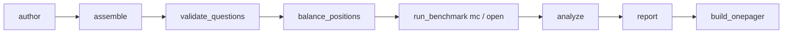

# CLI reference

Complete reference for every runnable module in the `deseretbench` package, in
pipeline order. All modules are invoked as `python -m deseretbench.<module>`
(with the project venv, `.venv/bin/python -m deseretbench.<module>`).

Modules **without** a CLI: `schema.py`, `stats.py`, `judge.py`, and
`score_mc.py` are library modules with no `__main__` block and cannot be run
directly. `runner.py` has a `__main__` block, but it is an ad-hoc smoke test,
not a pipeline step (see [runner smoke test](#deseretbenchrunner-smoke-test)).

Path resolution convention: unless noted otherwise, config files
(`configs/run_config.yaml`, `configs/models.yaml`) and default output paths
are resolved relative to the **repo root** (`ROOT`, the parent of the
`deseretbench` package directory), not the current working directory.
Explicitly passed file arguments (`--questions`, `--out` on `run_benchmark`,
`--in`/`--out` on `balance_positions`, `--run` on `analyze`) are plain paths
resolved relative to the cwd.

Pipeline order:



Related reference pages: [configuration](configuration.md) ·
[cache](cache.md) · [data formats](data-formats.md) ·
[scripts](scripts.md) · [glossary](glossary.md).

---

## `deseretbench.author`

```
python -m deseretbench.author [--max-parallel N] [--model ID] [--effort E] [--force]
```

Authors candidate questions, one model completion per (dimension, difficulty,
batch) cell.

| Flag | Type | Default | Meaning |
|---|---|---|---|
| `--max-parallel` | int | `8` | Concurrent model calls; overrides `runner.max_parallel` from config |
| `--model` | str | `claude-opus-4-8` | Authoring model |
| `--effort` | str | `high` | Effort level passed to the runner |
| `--force` | flag | off | Re-author cells whose raw files already look complete |

**Inputs read:** `configs/run_config.yaml` (`runner` section; `timeout_seconds`
is forced to at least 300 because authoring outputs are long),
`data/grounding_brief.md` (read at import time — the module crashes on import
if it is missing), existing `data/raw/*.jsonl` files (for cell skipping).

**Outputs written:** `data/raw/mc_<dimension>_<difficulty>_b<idx>.jsonl` and
`data/raw/open_<dimension>_b<i>.jsonl`, one file per cell, opened in `'w'`
mode (a re-run overwrites the previous cell file). Only items that pass
`schema.validate_item` are written. Response cache: hardcoded `ROOT/cache`.

**Behavior notes:**

- Without `--force`, a cell is skipped when its raw file already contains at
  least `ceil(0.7 × expected)` schema-valid JSONL lines.
- Each cell over-authors ~1.3× the dimension target, split roughly 30% basic /
  40% intermediate / 20% advanced / remainder expert, in batches of up to 9
  items.
- Prints per-cell progress and total live spend on exit; no meaningful
  non-zero exit paths beyond unhandled I/O errors.

---

## `deseretbench.assemble`

```
python -m deseretbench.assemble
```

**No flags.** The module has a `__main__` block but no argparse; it takes no
arguments.

Merges all raw authoring cells into deduplicated candidate pools.

**Inputs read:** every `data/raw/*.jsonl` file (parsed tolerantly — code
fences and pretty-printed JSON blocks are handled).

**Outputs written:** `data/candidates_mc.jsonl` and
`data/candidates_open.jsonl`.

**Behavior notes:**

- Drops schema-invalid items; assigns `question_id = content_hash_id(item)`.
- Dedupes by both content hash and normalized question stem (lowercased,
  alphanumeric-collapsed, first 160 characters).
- Prints a summary report (file/line counts, MC/open breakdowns by dimension
  and difficulty, dropped-item detail). No network calls; safe to re-run.

---

## `deseretbench.validate_questions`

```
python -m deseretbench.validate_questions [--max-parallel N] [--effort E] [--limit K] [--no-holdout]
```

Runs a five-persona LLM review of every candidate item, applies quorum and
keep rules, and splits the survivors into public and holdout sets.

| Flag | Type | Default | Meaning |
|---|---|---|---|
| `--max-parallel` | int | `8` | Concurrent review calls |
| `--effort` | str | `medium` | First-pass review effort; failed reviews are re-solicited once at the next effort step up |
| `--limit` | int | `0` | `0` = review all candidates; otherwise truncate both the MC and open candidate lists to the first K |
| `--no-holdout` | flag | off | Skip the stratified 20% holdout split; all kept items go public |

**Inputs read:** `data/candidates_mc.jsonl`, `data/candidates_open.jsonl`,
`configs/run_config.yaml` (`runner` section; `stats.rng_seed` and
`stats.holdout_fraction` for the split).

**Outputs written:** `data/reviews_mc.jsonl`, `data/reviews_open.jsonl` (raw
persona reviews; a re-solicited persona produces two records),
`data/questions_mc.jsonl`, `data/questions_open.jsonl` (kept items, with the
`_review` field stripped), `data/private_holdout/mc.jsonl`,
`data/private_holdout/open.jsonl` (untracked; see
[holdout stance](../explanation/holdout-stance.md)), and
`data/validation_report.json` (counts, drop reasons, Fleiss' kappa, spend).

**Behavior notes:**

- Reviews always run on the fixed model `claude-opus-4-8` regardless of CLI
  args; the CLI's `--effort` controls effort only. Response cache: hardcoded
  `ROOT/cache`.
- The five reviewer personas are fixed: `orthodox_member`,
  `byu_religion_instructor`, `church_historian`, `adult_convert`,
  `international_returned_missionary`.
- Quorum: fewer than 3 usable persona reviews marks an item **unreviewed**
  (dropped as an infrastructure outcome, not a quality verdict).
- MC keep rule: key agreement ≥ 0.6 and mean clarity ≥ 4.0 and mean
  defensible options ≤ 1.5 and bad flags ≤ 1. Open keep rule: mean realistic
  ≥ 4.0 and mean rubric-fair ≥ 4.0 and mean clarity ≥ 4.0 and bad flags ≤ 1.
- Holdout stratifies by (dimension, difficulty) with `stats.rng_seed` (MC)
  and `rng_seed + 1` (open).

---

## `deseretbench.balance_positions`

```
python -m deseretbench.balance_positions --in PATH --out PATH [--seed N] [--force]
```

Permutes MC answer positions so the correct answer's slot is drawn uniformly
at random per item (v0.1 authoring skewed toward key B).

| Flag | Type | Default | Meaning |
|---|---|---|---|
| `--in` | str | *(required)* | Input MC question file |
| `--out` | str | *(required)* | Output path; `--in` equal to `--out` (in-place) is the documented usage |
| `--seed` | int | `19470417` | RNG seed for the permutation |
| `--force` | flag | off | Re-balance even though a balance marker or backup exists (for re-authored sets only) |

**Inputs read:** the `--in` JSONL file (cwd-relative).

**Outputs written:** the balanced `--out` file, a pre-balance backup at
`<out-stem>.prebalance.jsonl`, and a balance marker
`<out>.balance_meta.json` containing `{seed, n_items, position_map}` (the
position map lets pre-balance artifacts such as reviewer letters stay
interpretable).

**Exit behavior:**

- Without `--force`, `SystemExit` if either the balance marker or the
  `.prebalance` backup exists — the permutation is not idempotent, and
  re-balancing would silently diverge from the published run.
- `SystemExit` if balancing produces any schema-invalid item (checked with
  `validate_mc_item` before writing).
- `ValueError` if an item's `distractor_types` is not a list or its length
  differs from `choices`.
- With `--force`, a pre-existing backup is rotated aside first (only one
  rotated generation is kept; the rotated name gains a doubled
  `.prebalance.prebalance.1.jsonl` segment).

Prints the key-letter distribution before and after.

---

## `deseretbench.run_benchmark`

```
python -m deseretbench.run_benchmark mc   --questions PATH --out DIR [--models a,b] [--runs N] [--limit K] [--max-parallel P]
python -m deseretbench.run_benchmark open --questions PATH --out DIR [--models a,b] [--runs N] [--limit K] [--max-parallel P] [--judge-crosscheck]
```

Runs the benchmark itself. Two required subcommands: `mc` (multiple choice,
inline-scored) and `open` (open-ended: generate, judge, aggregate).

Flags common to both subcommands:

| Flag | Type | Default | Meaning |
|---|---|---|---|
| `--questions` | str | *(required)* | Question JSONL file (cwd-relative) |
| `--out` | str | *(required)* | Run directory for output JSONL files (cwd-relative) |
| `--models` | str | `""` | Comma-separated model ids; empty = the full 22-model cohort from `configs/models.yaml` |
| `--runs` | int | `0` | Runs per item per model; `0` = config default (`runs.multiple_choice` for `mc`, `runs.open_ended` for `open`) |
| `--limit` | int | `0` | `0` = all items; otherwise truncate the question list to the first K |
| `--max-parallel` | int | `0` | `0` = config default (`runner.max_parallel`); a nonzero value overrides it |

`open` only:

| Flag | Type | Default | Meaning |
|---|---|---|---|
| `--judge-crosscheck` | flag | off | Additionally judge a seeded `judges.crosscheck_fraction` (default 0.25) subsample of successfully generated responses with `judges.crosscheck_model`; raw verdicts are recorded for judge-sensitivity analysis and do **not** feed panel scores |

**Inputs read:** the `--questions` file; `configs/run_config.yaml` and
`configs/models.yaml` (repo-root-relative). The response cache directory is
`ROOT/<runner.cache_dir>` (default `ROOT/cache`); successful calls are
content-addressed cached, failed calls are not, so re-running a phase retries
only failures. See [cache](cache.md).

**Outputs written (into `--out`):**

| File | Phase | Content |
|---|---|---|
| `mc_responses.jsonl` | mc | One record per (model, item, run) with inline correctness scoring |
| `open_responses.jsonl` | open | One record per (model, item, run) generation |
| `open_judge_raw.jsonl` | open | One record per (response, persona) judge verdict; primary and crosscheck rows share the file, distinguished by `judge_role` |
| `open_scores.jsonl` | open | One aggregated panel record per (model, item, run) |
| `config_snapshot.json` | both | Per-phase provenance (written after the phase's sinks close), keyed `mc`/`open` |

Field-by-field record layouts are in [data formats](data-formats.md). Output
files are written atomically: records stream to `<path>.tmp` and are
`os.replace`d onto the final path only on close, so a crash mid-phase leaves
the previous complete file intact.

**Exit behavior:**

- `SystemExit` if zero items load from `--questions`.
- `SystemExit` from cohort selection if `--models` contains any unknown id
  (or is all-whitespace); the error lists the valid cohort ids. Unknown ids
  are a hard error, never silently ignored.
- `SystemExit` before any spend if `--judge-crosscheck` is set but
  `configs/models.yaml` has no `judges.crosscheck_model`.
- `mc` refuses to touch output files if zero jobs were built.

**Behavior notes:**

- The judge "panel" is one judge model (`judges.primary_model`) called once
  per persona in `judges.personas` (three personas). See
  [judge design](../explanation/judge-design.md).
- Failed generations are recorded with empty text and skipped by the judge
  phase; a warning tells you to re-run the phase before analyzing. Judge
  responses that succeed but fail JSON parsing are cached and will replay
  identically on re-run.
- After each phase a quick per-model summary prints (MC: accuracy over
  `call_ok` records, parse-fail rate, call-failure count; open: mean
  composite). Progress lines print every 50 (MC/judge) or 25 (generation)
  completions with live spend.

For interrupted runs and the retry-wave wrapper scripts, see
[recover an interrupted run](../how-to/recover-interrupted-run.md) and
[scripts](scripts.md).

---

## `deseretbench.analyze`

```
python -m deseretbench.analyze --run DIR [--out PATH]
```

Computes the statistical summary of a run.

| Flag | Type | Default | Meaning |
|---|---|---|---|
| `--run` | str | *(required)* | Run directory, e.g. `runs/v0_1` (cwd-relative) |
| `--out` | str | `results/summary.json` | Output path, resolved relative to the repo root |

**Inputs read:** under the run dir: `mc_responses.jsonl` (MC analysis, only
if present), `open_scores.jsonl` and `open_judge_raw.jsonl` (open analysis;
if `open_scores.jsonl` is missing, `summary["open"]` is `null`), and
`config_snapshot.json` (provenance — preferred over the live config; a
missing or corrupt snapshot falls back to the live config with a warning).
Also `configs/run_config.yaml` (`stats` section: `rng_seed`,
`bootstrap_resamples`, `ci_level`) and `configs/models.yaml` (cohort).

**Outputs written:** the summary JSON at `--out` (top-level keys: `run`,
`config`, `mc` when present, `open` possibly null).

**Behavior notes:**

- Records from model ids not in the cohort are excluded with a warning.
  Call failures and genuine served-model fallbacks are treated as missing
  data, not wrong answers.
- All bootstraps are seeded deterministically per call site via
  `derive_seed`; pairwise p-values are Holm-adjusted per phase. Method
  details: [statistics](../explanation/statistics.md).
- After writing, prints MC and open leaderboards with CIs and judge IRR to
  stdout.

---

## `deseretbench.report`

```
python -m deseretbench.report [--summary PATH]
```

Renders the summary into Markdown, HTML, and figures.

| Flag | Type | Default | Meaning |
|---|---|---|---|
| `--summary` | str | `results/summary.json` | Summary JSON, resolved relative to the repo root |

**Inputs read:** the summary JSON only.

**Outputs written:** `reports/RESULTS.md`, `reports/leaderboard.html`, and up
to 6 PNGs under `reports/figures/` — `overall_ci.png`,
`radar_dimensions.png`, `difficulty_bars.png`, `generational.png` (MC, only
if the summary has an `mc` section) and `open_overall_ci.png`,
`open_generational.png` (only if `open` is non-null). All figures at
dpi 120, Agg backend.

**Behavior notes:**

- `leaderboard.html` embeds only figures regenerated by the current
  invocation (a PNG left on disk by an earlier run may not match the
  summary); figures are referenced by relative path, so the HTML is not
  self-contained.
- Missing per-group data plots as a visible gap (`NaN`), never as a zero
  score.
- Current per-model numbers live in the generated `reports/RESULTS.md`, not
  in this documentation.

---

## `deseretbench.build_onepager`

```
python -m deseretbench.build_onepager [--summary PATH] [--validation PATH] [--out PATH]
```

Builds the single-file shareable report ("The Deseret Codex").

| Flag | Type | Default | Meaning |
|---|---|---|---|
| `--summary` | str | `results/summary.json` | Summary JSON (repo-root-relative) |
| `--validation` | str | `data/validation_report.json` | Validation report (repo-root-relative) |
| `--out` | str | `reports/deseretbench_report.html` | Output HTML (repo-root-relative) |

**Inputs read:** the summary JSON, the validation report, font files from
`assets/fonts/` (missing fonts warn and fall back to system fonts), and four
figure PNGs from `reports/figures/` (Plates I–IV: `open_overall_ci.png`,
`open_generational.png`, `radar_dimensions.png`, `difficulty_bars.png`).

**Outputs written:** one self-contained HTML file (fonts and figures
base64-embedded), suitable for printing to PDF; prints its size in KB.

**Exit behavior:** `SystemExit` if the summary lacks either the `mc` or
`open` section — the one-pager needs a full run.

**Behavior notes:**

- Figure gating is existence-only: a missing PNG warns and drops that plate,
  but a **stale** PNG from an older run will be embedded without complaint
  (there is no freshness or hash check). Run `deseretbench.report` first.
- Two curated question examples in the page are hardcoded module constants,
  not computed from the summary; all leaderboard numbers in the prose are
  computed from the summary.

---

## `deseretbench.runner` (smoke test)

```
python -m deseretbench.runner [--model ID] [--prompt TEXT] [--effort E]
```

`runner.py` is the model-call engine used by every other module; its
`__main__` block is an **ad-hoc smoke test** that makes a single model call
and prints the result JSON. It is not part of the pipeline.

| Flag | Type | Default | Meaning |
|---|---|---|---|
| `--model` | str | `claude-haiku-4-5-20251001` | Model to call |
| `--prompt` | str | `What is 7+5? Reply with only the number.` | User prompt |
| `--effort` | str | `low` | Effort level |

**Behavior notes:**

- It builds its own minimal config (`backend: claude_cli`,
  `max_parallel: 1`) — it does **not** read `configs/run_config.yaml`.
- **cwd gotcha:** it constructs `Runner(cfg, cache_dir="cache")` with a
  *relative* path, which `Runner.__init__` resolves against the current
  working directory. Run from anywhere other than the repo root, it creates
  a fresh `./cache` directory there and misses the repo's response cache.
  Pipeline modules do not share this problem (they pass absolute
  `ROOT`-based cache paths). See [cache](cache.md).
- Retries on failure use **linear** backoff (`retry_backoff_seconds ×
  attempt`), not exponential — a property of the `Runner` itself, visible in
  any module that uses it.
