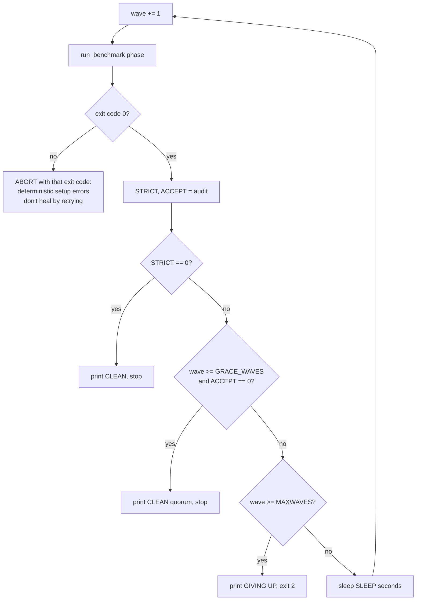

# Scripts reference

Complete reference for the four files in `scripts/`. All three shell scripts `cd` to the
repo root on startup and invoke Python as `.venv/bin/python`, so they assume the
[environment setup](../tutorials/first-run.md) has been done. The fourth file is a
workflow definition for an agent harness, not a shell script.

For task-oriented walkthroughs, see [recover an interrupted run](../how-to/recover-interrupted-run.md)
and [rerun analysis](../how-to/rerun-analysis.md). For the Python module CLIs these
scripts wrap, see the [CLI reference](cli.md).

| Script | Purpose |
|---|---|
| `run_all.sh` | Full 7-step pipeline (author → report) in one command |
| `resilient_run.sh` | Loop one benchmark phase in waves until zero failures remain |
| `finish_pipeline.sh` | MC → open → analyze → report, unattended and usage-limit-safe |
| `author_questions.wf.js` | Agent-workflow definition for multi-agent question authoring |

---

## scripts/run_all.sh

### Synopsis

```bash
scripts/run_all.sh [run_dir]
```

| Input | Default | Meaning |
|---|---|---|
| `$1` (run_dir) | `runs/v0_1` | Output directory for benchmark responses |
| `MAX_PARALLEL` (env) | `8` | Passed as `--max-parallel` to every step that accepts it |

### Behavior

Runs `set -euo pipefail`, so any failing step aborts the whole pipeline. The seven steps,
in order:

| Step | Command |
|---|---|
| 1/7 author | `python -m deseretbench.author --max-parallel $P` |
| 2/7 assemble | `python -m deseretbench.assemble` |
| 3/7 validate | `python -m deseretbench.validate_questions --max-parallel $P` |
| 4/7 balance | `rm -f data/questions_mc.jsonl.balance_meta.json data/questions_mc.prebalance.jsonl`, then `python -m deseretbench.balance_positions --in data/questions_mc.jsonl --out data/questions_mc.jsonl` |
| 5/7 run MC | `python -m deseretbench.run_benchmark mc --questions data/questions_mc.jsonl --out $RUN --max-parallel $P` |
| 6/7 run OPEN | `python -m deseretbench.run_benchmark open --questions data/questions_open.jsonl --out $RUN --max-parallel $P` |
| 7/7 analyze+report | `python -m deseretbench.analyze --run $RUN && python -m deseretbench.report` |

Notes:

- Step 4 deletes the old balance marker (`*.balance_meta.json`) and pre-balance backup
  before re-balancing, because a freshly validated question set makes any previous
  marker stale.
- Step 6 does **not** pass `--judge-crosscheck`. No script in `scripts/` does; crosscheck
  judging happens only via manual invocation
  (see [run the judge crosscheck](../how-to/run-judge-crosscheck.md)).
- Step 7 passes no `--out` to `analyze` and no `--summary` to `report`. Both fall back to
  their argparse defaults, which are `results/summary.json` in each case — so the data
  flow is the same as `finish_pipeline.sh`, just implicit rather than explicit.
- The pipeline is resumable because every successful model call is cached
  (see [cache reference](cache.md)); re-running the script redoes only failed work.
  Unlike `finish_pipeline.sh`, however, it does not loop on failures: a phase that ends
  with rate-limited calls simply leaves them failed.

---

## scripts/resilient_run.sh

### Synopsis

```bash
scripts/resilient_run.sh <mc|open> <run_dir> <questions.jsonl> [sleep_secs]
```

| Input | Default | Meaning |
|---|---|---|
| `$1` (phase) | required | `mc` or `open` |
| `$2` (run_dir) | required | Output directory, e.g. `runs/v0_1` |
| `$3` (questions) | required | Question file for that phase |
| `$4` (sleep_secs) | `1500` | Seconds to sleep between waves |
| `MAX_PARALLEL` (env) | `8` | Passed as `--max-parallel` |
| `MAXWAVES` (env) | `40` | Give up after this many waves |
| `QUORUM` (env) | `2` | Judge verdicts a panel must keep to count as scoreable |
| `GRACE_WAVES` (env) | `3` | Retry honestly this many waves before accepting on quorum |

### Why it exists

The authenticated `claude` CLI enforces a rolling session usage limit; long runs hit
HTTP 429 partway through. Successful calls are content-addressed and cached, and failed
(`ok=False`) calls are **not** cached, so re-running a phase retries only what failed
while completed work returns instantly from cache. This wrapper loops the phase until
nothing is left to do, sleeping through each limit-reset window.

### Wave loop

The script uses `set -uo pipefail` — deliberately **not** `-e` — so it can inspect
`run_benchmark`'s exit code instead of dying on it.



Abort conditions, exactly:

1. `run_benchmark` exits nonzero → abort immediately with that exit code (setup errors
   such as a bad question path or unknown model id would fail identically every wave).
2. `wave >= MAXWAVES` with work remaining → print `GIVING UP` and `exit 2`.

### Two signals, not one (`deseretbench.audit`)

The audit answers two questions that look alike and are not
([ADR-0012](../adr/0012-operator-settings-isolation-and-judge-quorum.md)):

| Signal | Question | Drives |
|---|---|---|
| `strict_fail` | Could a retry still heal this? | whether to run another wave |
| `accept_fail` | Does anything still block scoring? | whether the phase may finish anyway |

Conflating them is not hypothetical: it stalled the 22-model run. One judge call was
rejected by the served-model guard, which no retry was guaranteed to clear. The old gate
counted it as work remaining and would have retried for 40 waves (~16 h) and then exited
nonzero — so `analyze` and `report` would never have run on a dataset that was already
complete.

`strict_fail` counts, per output file:

- records with `call_ok: false` (rate-limited/errored calls — not cached, so a re-run
  retries them),
- corrupt/unparseable JSONL lines,
- **missing** records: `expected − present`, floored at 0.

`accept_fail` tolerates only judge-call failures, and only while every panel keeps
`QUORUM` parsed verdicts. It never tolerates a failed or missing **generation**, and
never a corrupt line. Both matter: with nothing generated there are no panels, so no
panel is below quorum — quorum alone would call an empty run complete. The generation
terms are what stop that (`tests/test_audit.py` pins it).

Tolerating means **dropping** the bad verdict, never substituting one. A rejected
verdict is discarded and `aggregate_panel` scores the panel over its remaining judges,
treating the gap as missing data rather than zero. Recording a wrong-model verdict under
the requested model's name would contaminate the panel with a second judge model — the
exact thing the guard exists to prevent.

Expected counts are computed from the configs and the question file:

| Phase / file | Expected records |
|---|---|
| `mc` → `mc_responses.jsonl` | `n_items × n_models × runs.multiple_choice` |
| `open` → `open_responses.jsonl` | `n_items × n_models × runs.open_ended` |
| `open` → `open_judge_raw.jsonl` | `(generated_total − generation_failures) × n_personas` |

where `n_models` is the size of the **full** `configs/models.yaml` cohort, `n_items` is
every non-blank line of the questions file, `n_personas` is the length of
`judges.personas`, and the `runs.*` values come from `configs/run_config.yaml`.

Two standing caveats:

- **Deliberate exclusion:** `parse_ok=False` on a `call_ok=True` judge record is *not*
  counted in `strict_fail`. That response is cached and will replay identically, so
  retrying could never heal it — counting it would loop forever. It does count against
  quorum, because a verdict with no scores is not a judge.
- **Crosscheck caveat:** crosscheck verdicts (`--judge-crosscheck`) are appended to the
  *same* `open_judge_raw.jsonl`. The quorum scan ignores them (`judge_role != primary`),
  so a crosscheck verdict can no longer fill a gap in the scored panel or block
  completion. The strict scan still counts every line, so crosscheck records inflate the
  present count against the primary-only expectation and burn retries until
  `GRACE_WAVES` expires. Prefer not to point `resilient_run.sh` at a run directory
  containing crosscheck records.

Because `n_models` and `n_items` come from the full cohort and full question file, the
script only works correctly for full-cohort, full-set runs — it has no notion of
`--models` or `--limit` subsets.

The audit prints `strict accept` to stdout and the human-readable breakdown to stderr,
so `read -r STRICT ACCEPT < <(audit)` captures the numbers while the breakdown still
reaches the terminal. It is also runnable directly:

```bash
uv run python -m deseretbench.audit open --run runs/v0_1 \
    --questions data/questions_open.jsonl --quorum 2
```

---

## scripts/finish_pipeline.sh

### Synopsis

```bash
scripts/finish_pipeline.sh [run_dir]
```

| Input | Default | Meaning |
|---|---|---|
| `$1` (run_dir) | `runs/v0_1` | Output directory for benchmark responses |
| `SLEEP` (env) | `1500` | Forwarded to `resilient_run.sh` as its sleep interval |
| `MAX_PARALLEL` (env) | `8` | Exported, so the resilient wrapper inherits it |

`MAXWAVES` is *not* set or forwarded; the wrapper's own default of 40 applies unless the
caller exports `MAXWAVES` themselves.

### Behavior

Finishes the *measurement* half of the pipeline unattended: it skips authoring,
assembly, validation, and balancing entirely and starts at the MC phase on the
already-balanced question set. It first prints `wc -l` of both question files as a
sanity banner, then runs four steps, each with a distinct exit code on failure:

| Step | Command | Exit on failure |
|---|---|---|
| 1/4 MC | `bash scripts/resilient_run.sh mc $RUN data/questions_mc.jsonl $SLEEP` | 2 |
| 2/4 OPEN | `bash scripts/resilient_run.sh open $RUN data/questions_open.jsonl $SLEEP` | 3 |
| 3/4 analyze | `python -m deseretbench.analyze --run $RUN --out results/summary.json` | 4 |
| 4/4 report | `python -m deseretbench.report --summary results/summary.json` | 5 |

On success it prints `PIPELINE_COMPLETE -> reports/leaderboard.html`. Generated outputs
are `reports/RESULTS.md`, `reports/leaderboard.html`, and `reports/figures/` — see
[regenerate reports](../how-to/regenerate-reports.md).

### Differences from `run_all.sh`

- `run_all.sh` builds the question set first (steps 1–4); `finish_pipeline.sh` assumes
  it exists.
- `run_all.sh` runs each benchmark phase **once** and aborts on any failure (`set -e`);
  `finish_pipeline.sh` wraps each phase in `resilient_run.sh` waves and maps each stage
  to a distinct exit code.
- Analyze/report invocation: `finish_pipeline.sh` passes `--out results/summary.json`
  and `--summary results/summary.json` explicitly; `run_all.sh` passes neither flag and
  relies on the argparse defaults. Both defaults are `results/summary.json`, so the two
  paths are equivalent in effect — only the explicitness differs.

### Cosmetic staleness

The step banners read the cohort size from `configs/models.yaml` at run time
(`NMODELS=$(grep -c '^  - id:' ...)`, twenty-three models at time of writing); run counts
come from `configs/run_config.yaml`. Both are read by `run_benchmark` and by
`deseretbench.audit`, so the banners follow the config rather than restating it.

---

## scripts/author_questions.wf.js

### Synopsis

Not a shell script. This is a workflow definition (ES module) for an agent-orchestration
harness: it exports a `meta` object (name `deseretbench-author`, two phases: `Author MC`
and `Author Open`) and a top-level script that uses harness-provided globals —
`agent(prompt, opts)`, `parallel(...)`, and `log(...)`. It cannot be run with `node` or
`bash`; it is executed by the workflow runner, with the repo root as the agents' working
directory.

Its pure-Python counterpart is `python -m deseretbench.author` (what `run_all.sh` step 1
runs). `author.py`'s own docstring notes that cells whose `data/raw/` file already exists
with enough valid items are skipped, so the two authoring paths complement rather than
clobber each other.

### Behavior

The script fans out one authoring agent per (dimension, difficulty, batch) cell:

- **Shared prompt blocks** — every agent prompt embeds the benchmark's framing
  (`STANCE`: mainstream/official/correlated position; heterodox readings appear only as
  distractors), a `GROUNDING` block of verified facts as of June 2026 (used for currency
  items), the six-type `DISTRACTORS` palette, and authoring `RULES` (plausible
  discriminative distractors, ≥2 trap types per item, one defensibly-correct answer,
  cited `source`, explanatory `notes`, optional WebSearch verification).
- **MC job construction** — seven MC dimensions (`doctrine_scripture` 45,
  `ordinances_covenants` 30, `church_organization` 22, `eternal_family` 25,
  `restoration_history` 30, `living_gospel` 28, `cultural_fluency` 25 target items).
  `splitCounts` over-authors each target by 1.3× (`Math.ceil(target * 1.3)`), then splits
  the authored count roughly 30% basic / 40% intermediate / 20% advanced, with expert
  taking the remainder (minimum 2). Each cell is chunked into batches of at most
  `BATCH = 9` items, and each batch's subtopic list is rotated by batch index so batches
  in the same cell diverge instead of duplicating stems.
- **Open job construction** — eight fixed batches (five `life_choice`, three
  `cultural_open`), each with an explicit theme string and count (57 items total across
  jobs, matching the published open candidate pool), producing rubric-bearing scenario items (`must_include`, `should_not`,
  `ideal_reasoning_pattern`).
- **Output contract** — each agent writes its items as raw JSON Lines to an exact path
  `data/raw/mc_<dimension>_<difficulty>_b<N>.jsonl` (or `open_<dim>_b<N>.jsonl`), then
  returns a structured summary validated against `SUMMARY_SCHEMA` (`path`,
  `count_written`, `dimension`, `difficulty` required).
- **Execution** — all MC batches run in parallel, then all open batches; the script logs
  batch success counts and total items written, and returns
  `{ batches, totalWritten, files }`.

Downstream, `deseretbench.assemble` merges the `data/raw/` shards and
`deseretbench.validate_questions` reviews them — see
[add questions](../how-to/add-questions.md).
