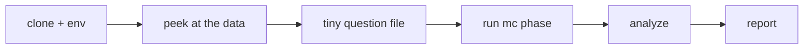

# Your first DeseretBench run

This tutorial walks you from a clean clone to reading real results, on a
deliberately tiny scope: **one model, five questions, one run each — five API
calls total**. That keeps the cost to pennies and the wall-clock time to a
couple of minutes, while exercising the exact same pipeline as a full
benchmark run.

By the end you will have:

- a working environment,
- a five-item multiple-choice run of one model,
- a statistical summary and a generated report you can open in a browser,
- a mental model of the response cache that makes every re-run cheap.



## Prerequisites

- A terminal, with the repo cloned and your shell sitting at the repo root.
- [`uv`](https://docs.astral.sh/uv/) installed.
- An authenticated `claude` CLI. The default backend
  (`runner.backend: claude_cli` in [`configs/run_config.yaml`](../../configs/run_config.yaml))
  shells out to it, so no API key is needed — but the CLI must work when you
  type `claude` yourself.

All commands below assume you are at the repo root.

## Step 1 — Set up the environment

```console
$ uv venv --python 3.12 .venv
$ uv pip install --python .venv/bin/python -e .
```

That installs the `deseretbench` package and its dependencies (numpy, scipy,
pandas, matplotlib, jinja2, pyyaml, and friends) into `.venv`. Verify:

```console
$ .venv/bin/python -m deseretbench.run_benchmark --help
usage: run_benchmark.py [-h] {mc,open} ...
```

If you see the `{mc,open}` subcommands, the install worked.

## Step 2 — Look at one question

Before running anything, look at what the benchmark actually asks. The public
multiple-choice set lives in `data/questions_mc.jsonl` (213 items, one JSON
object per line; the open-ended set `data/questions_open.jsonl` has 40).

```console
$ head -1 data/questions_mc.jsonl | jq .
```

```json
{
  "format": "mc",
  "axis": "doctrinal_accuracy",
  "dimension": "church_organization",
  "difficulty": "advanced",
  "question": "On the death of the President of the Church, why is it doctrinally accurate to say the new President 'receives no priesthood keys he did not already hold,' ...",
  "choices": [
    "Because the keys pass from the deceased President to his first counselor ...",
    "Because every Apostle, at his ordination, already receives all the keys of the kingdom, ...",
    ...
  ],
  "answer_index": 1,
  "distractor_types": [
    "plausible_near_miss",
    "correct",
    "plausible_near_miss",
    "folk_doctrine_trap"
  ],
  "source": "Boyd K. Packer, 'The Twelve Apostles' (Nov 1996 Ensign); D&C 107; ...",
  "notes": "Tests the subtle teaching that all Twelve hold all keys latently; ...",
  "question_id": "church_organization_advanced_bceefdc3c6"
}
```

Field by field:

| Field | Meaning |
|---|---|
| `format` | `mc` here; open-ended items say `open` and carry a `prompt` + `rubric` instead of `choices`. |
| `axis` | Which of the benchmark's scoring axes the item belongs to (e.g. `doctrinal_accuracy`, `cultural_fluency`). |
| `dimension` | One of the seven content dimensions (doctrine & scripture, church organization, …) used for the per-dimension breakdowns. |
| `difficulty` | `basic` / `intermediate` / `advanced` / `expert`. |
| `question`, `choices` | The stem and the options. Options are shuffled and position-balanced upstream; the model sees them lettered A–D. |
| `answer_index` | Zero-based index of the correct choice. |
| `distractor_types` | One tag per choice: the correct one is tagged `correct`, each wrong one is tagged with the *kind* of error it embodies (`folk_doctrine_trap`, `protestant_trap`, `plausible_near_miss`, …). This typing is the benchmark's core design idea — see [why typed distractors](../explanation/why-typed-distractors.md). |
| `source`, `notes` | Grounding citation and the author's rationale. Never shown to the model. |
| `question_id` | Stable id: `<dimension>_<difficulty>_<hash>`. |

## Step 3 — Make a tiny question file

A full run is cohort × items × repeats. To keep this cheap, trim a scratch
copy of the questions to five items:

```console
$ mkdir -p /tmp/deseret-tiny
$ head -5 data/questions_mc.jsonl > /tmp/deseret-tiny/mc5.jsonl
$ wc -l /tmp/deseret-tiny/mc5.jsonl
5 /tmp/deseret-tiny/mc5.jsonl
```

You don't strictly need the scratch copy — the runner has a `--limit` flag
that does the same truncation — but making the file yourself shows that
`--questions` accepts any JSONL path, which is how you'd point the harness at
your own item sets later.

These are the *only* scoping flags `run_benchmark` has (from its argparse; run
`--help` to confirm):

| Flag | Effect | Default |
|---|---|---|
| `--questions PATH` | Question JSONL to run (required). Relative paths resolve from your current directory. |
| `--out DIR` | Run directory; output JSONL files land here (required). |
| `--models a,b` | Comma-separated model ids from `configs/models.yaml`. Empty = the full cohort. An unknown id is a hard error that lists the valid ids. | full cohort |
| `--runs N` | Repeats per (model, item). `0` = the config default (`runs.multiple_choice: 5` for mc). | `0` |
| `--limit K` | Use only the first K items of the questions file. `0` = all. | `0` |
| `--max-parallel P` | Override `runner.max_parallel` (config default 8). `0` = use config. | `0` |

(The `open` subcommand additionally accepts `--judge-crosscheck`; not needed
today.)

## Step 4 — Run the tiny MC phase

Pick one model id from the `cohort` list in
[`configs/models.yaml`](../../configs/models.yaml) — the haiku-tier model is
the cheapest and fastest. Then:

```console
$ .venv/bin/python -m deseretbench.run_benchmark mc \
    --questions /tmp/deseret-tiny/mc5.jsonl \
    --out runs/tiny \
    --models claude-haiku-4-5-20251001 \
    --runs 1
```

Expected output (the accuracy numbers and spend are illustrative — yours will
vary):

```text
[MC] 1 models x 5 items x 1 runs = 5 calls | effort=low parallel=8
  ... 5/5 ($0.01 live)
[MC] wrote 5 records to runs/tiny/mc_responses.jsonl | live spend $0.01

[MC] quick accuracy (over completed calls; transport failures excluded):
  Haiku 4.5    acc=0.800  parse_fail=0.000  n=5
```

Two things happened on the side:

- A `./cache/` directory appeared (or grew) at the repo root, holding one
  `<sha256>.json` file per successful call — the response cache is
  content-addressed on the call's inputs (backend, model, system prompt,
  rendered prompt, effort, run index).
- `runs/tiny/config_snapshot.json` was written *after* the output file
  committed, recording exactly which cohort and run config produced this data.

**Run the same command again.** It finishes near-instantly: every call's cache
key matches an existing entry, so nothing is sent to the model — each record
in the rewritten output file now has `"cache_hit": true`. This is also the
resume mechanism: failed calls are never cached, so re-running a phase retries
only the gaps. See [the cache reference](../reference/cache.md).

## Step 5 — Tour the raw output

```console
$ head -1 runs/tiny/mc_responses.jsonl | jq .
```

One record per call, with three clusters of fields:

- **What was asked**: `model`, `tier`, `label`, `question_id`, `dimension`,
  `difficulty`, `axis`, `run_index`, `answer_index`.
- **What happened on the wire**: `call_ok`, `model_served` and `served_all`
  (which model *actually* answered — provenance for the analysis stage),
  `stop_reason`, `called_at`, `attempts`, `cache_hit`, `error`, `duration_ms`,
  `cost_usd`, `input_tokens`, `output_tokens`.
- **How it was scored**: `text` (the full response), `parsed_letter` (the
  letter extracted from the required `ANSWER: <letter>` line), `parse_ok`, and
  `correct`.

Scoring is inline and mechanical — no judge model is involved for MC.

## Step 6 — Analyze

The analyzer turns raw records into a statistical summary (bootstrap CIs,
exact Clopper–Pearson intervals, per-dimension/difficulty breakdowns, item
analysis):

```console
$ .venv/bin/python -m deseretbench.analyze --run runs/tiny --out results/tiny_summary.json
```

> **Note:** `--out` resolves relative to the *repo root*, not your cwd. The
> default is `results/summary.json`, which is the repo's real, git-tracked
> summary — pass an explicit scratch name as above so you don't overwrite it.

Illustrative output:

```text
wrote /path/to/deseretBench/results/tiny_summary.json

MC leaderboard (acc [95% CI]):
  Haiku 4.5    0.800 [0.400,1.000] exactCI=[0.376,0.996] parse_fail=0.000 n=5
  item analysis: mean_p=... mean_disc=n/a (over 0/5 items with defined discrimination) ceiling=... floor=...
```

Don't read anything into these numbers — five items and one run is far below
the noise floor; that's the point of the CIs being enormous. Models with no
records in the run (the other eight) are simply absent, and the open-ended
section is `null` because `runs/tiny` has no `open_scores.jsonl`.

Peek at the summary's shape:

```console
$ jq 'keys' results/tiny_summary.json
[
  "config",
  "mc",
  "open",
  "run"
]
$ jq '.mc | keys' results/tiny_summary.json
[
  "by_axis",
  "by_difficulty",
  "by_dimension",
  "item_analysis",
  "n_records",
  "overall",
  "pairwise"
]
```

`config` records the provenance (effort, runs, seed, bootstrap resamples)
stamped from the run's own `config_snapshot.json`, not the live config files —
so the summary stays honest even if you edit configs later.

## Step 7 — Generate the report

> **Warning before you run this:** the report module has no output flag — it
> always writes to `reports/RESULTS.md`, `reports/leaderboard.html`, and
> `reports/figures/`, which are git-tracked artifacts of the repo's real
> benchmark run. Your tiny report will overwrite them. That's fine for
> learning; restore afterwards with
> `git checkout -- reports/ results/summary.json`.

```console
$ .venv/bin/python -m deseretbench.report --summary results/tiny_summary.json
wrote reports/RESULTS.md, reports/leaderboard.html, and 4 figure(s): overall_ci.png, radar_dimensions.png, difficulty_bars.png, generational.png
```

Only the four MC figures are produced (open-ended figures require open
results), and `leaderboard.html` embeds only figures regenerated by this same
invocation — a stale PNG from an earlier run is never silently reused.

Open the results:

- `reports/RESULTS.md` — the Markdown report: a header with run metadata (run
  dir, effort, runs per task, bootstrap resamples, seed, provenance), then the
  MC leaderboard table (accuracy, bootstrap *and* exact Clopper–Pearson CIs,
  parse-fail rate, run SD, n), a provenance-audit line, and by-dimension /
  by-difficulty tables. With one model the pairwise-significance section is still
  emitted, but its table is empty (a "0-comparison family") — pairwise numbers only
  appear once you run two or more models.
- `reports/leaderboard.html` — the same content rendered as a styled page with
  the figures inline. Open it in a browser (figures are referenced by relative
  path, so keep it where it was written).

Now restore the real artifacts:

```console
$ git checkout -- reports/ results/summary.json
$ rm -rf runs/tiny results/tiny_summary.json /tmp/deseret-tiny
```

(`runs/tiny` is untracked, so deleting it is the cleanup. The cache entries
your five calls created are harmless — content-addressed entries only ever
match identical future calls.)

## What you just did

You ran the full MC third of the pipeline — job building, the cached runner,
inline scoring, analysis, reporting — end to end, and saw why re-runs are
cheap. A real benchmark run is the same thing at full scope (the whole cohort
from `configs/models.yaml` × 213 items × 5 runs, plus the open-ended
generate → judge → aggregate phase), driven by the scripts described in the
[scripts reference](../reference/scripts.md).

## Where next

**Do a real task** (how-to guides):

- [Add a model to the cohort](../how-to/add-a-model.md)
- [Add questions](../how-to/add-questions.md)
- [Re-run the analysis](../how-to/rerun-analysis.md) and
  [regenerate the reports](../how-to/regenerate-reports.md)
- [Recover an interrupted run](../how-to/recover-interrupted-run.md)

**Understand the design** (explanation):

- [Why typed distractors](../explanation/why-typed-distractors.md) — the idea
  that makes the MC items discriminative
- [Judge design](../explanation/judge-design.md) — how the open-ended phase is
  scored (one judge model prompted as three personas, not three judges)
- [Measurement integrity](../explanation/measurement-integrity.md) — served-model
  provenance, caching, and what gets excluded from scoring

**Look things up** (reference):

- [CLI reference](../reference/cli.md) — every flag of every module
- [Cache reference](../reference/cache.md) — key composition, layout, invalidation
- [Data formats](../reference/data-formats.md) — full schemas for question and
  output records
